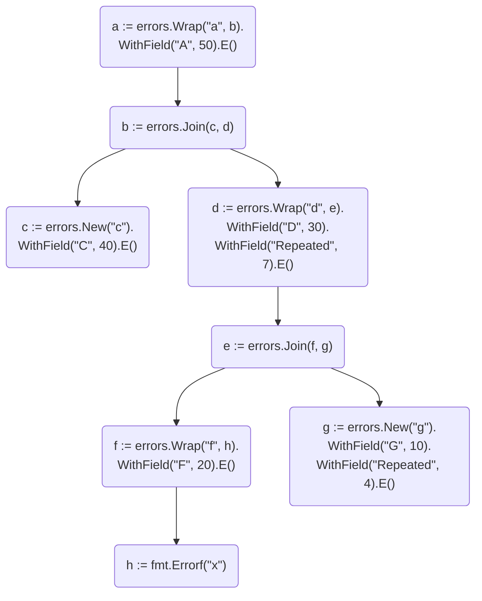

# errors <br> [![go.mod version][go-img]][go-url] [![CI][ci-img]][ci-url] [![Codecov][codecov-img]][codecov-url] [![Maintainability][codeclimate-img]][codeclimate-url] [![Go Report Card][goreportcard-img]][goreportcard-url] [![License][license-img]][license-url] [![Go Reference][godoc-img]][godoc-url]

Go library to construct errors with fields for structured logging.

Features:
- Wrap an error with string prefix
- Add custom fields to an error
- Extract all fields from chain of wrapped errors
- Join several errors into one error (build errors tree)
- Extract paths to each leaf from the errors tree
- Logger agnostic

## Motivation

When structured logger is used, it's better to have constant error messages. For example, message should not contain ID of your entity. Instead, such additional data should be logged in a separate fields. That makes it easier to search, group and analyse logs.

**Bad:**

```json
{"level": "error", "message": "can't find order a881ff5c-ef23-4e6c-a505-9b66ee42b779"}
```

**Good:**

```json
{"level": "error", "message": "can't find order", "order_id": "a881ff5c-ef23-4e6c-a505-9b66ee42b779"}
```

## Installation

```shell
go get github.com/maratori/errors
```

## Usage

### Example 1

- `errors.New` creates new error with message
- `errors.Wrap` adds string prefix to an error
- `errors.WithField` adds key-value pair to an error
- `errors.FieldsFromError` extracts key-value pairs from an error

```go
package pkg

import (
	"os"

	"github.com/maratori/errors"
	"golang.org/x/exp/slog"
)

func Example1() {
	logger := slog.New(slog.NewJSONHandler(os.Stdout))

	err := svc.ProcessRequest(request)
	if err != nil {
		var fields []any
		for key, value := range errors.FieldsFromError(err) {
			fields = append(fields, slog.Any(key, value))
		}
		logger.Error("can't process request", err, fields...)
		//	{
		//		"msg": "can't process request",
		//		"err": "can't borrow money: limit reached",
		//		"balance": 100,
		//		"requested": 50,
		//		"limit": 120,
		//		"request": ...
		//	}
	}
}

func (s *Service) ProcessRequest(request Request) error {
	switch r := request.(type) {
	case *BorrowMoneyRequest:
		err := s.BorrowMoney(r)
		return errors.Wrap("can't borrow money", err).
			WithField("request", r).E()
	}
	return nil
}

func (s *Service) BorrowMoney(request *BorrowMoneyRequest) error {
	wallet, err := s.repository.GetWallet(request.WalletID)
	if err != nil {
		return errors.Wrap("can't get wallet", err).
			WithField("wallet_id", request.WalletID).E()
	}

	if wallet.Balance+request.Amount > wallet.Limit {
		return errors.New("limit reached").WithFields(errors.Fields{
			"balance":   wallet.Balance,
			"requested": request.Amount,
			"limit":     wallet.Limit,
		}).E()
	}

	return nil
}
```

### Example 2

- `errors.AppendInto` and `errors.Join` joins several errors into single one
- `errors.Errros` extracts errors from an error, see [error tree](#error-tree)

```go
package pkg

import (
	"os"

	"github.com/maratori/errors"
	"golang.org/x/exp/slog"
)

func Example2() {
	logger := slog.New(slog.NewJSONHandler(os.Stdout))

	err := svc.ProcessRequest(request)
	for _, e := range errors.Errors(err) { // extract all errors
		var fields []any
		for key, value := range errors.FieldsFromError(e) {
			fields = append(fields, slog.Any(key, value))
		}
		logger.Error("can't process request", e, fields...)
	}
}

func (s *Service) ProcessRequest(request Request) error {
	switch r := request.(type) {
	case *PingFriendsRequest:
		err := s.PingFriends(r)
		return errors.Wrap("can't ping friends", err).
			WithField("request", r).E()
	}
	return nil
}

func (s *Service) PingFriends(request *PingFriendsRequest) error {
	user, err := s.repository.GetUser(request.UserID)
	if err != nil {
		return errors.Wrap("can't get user", err).
			WithField("user_id", request.UserID).E()
	}

	var errs error
	for _, friend := range user.Friends {
		err := s.pingFriend(user, friend)
		errors.AppendInto(&errs, errors.Wrap("can't ping friend", err).
			WithField("user", user).
			WithField("friend", friend).E())
	}
	return errs

	// Alternative:

	// var errs []error
	// for _, friend := range user.Friends {
	// 	err := s.pingFriend(user, friend)
	// 	errs = append(errs, errors.Wrap("can't ping friend", err).
	// 		WithField("user", user).
	// 		WithField("friend", friend).E())
	// }
	// return errors.Join(errs...)
}
```

## Error tree

Functions from this library create errors tree under the hood. Let's say you have the following chain of calls:



`errors.Errors` will return 3 errors (all possible paths from the root to leafs):

```go
errs := errors.Errors(a)
assert.Len(t, errs, 3)
assert.EqualError(t, errs[0], "a: c")
assert.EqualError(t, errs[1], "a: d: f: x")
assert.EqualError(t, errs[2], "a: d: g")
```

Each error can be passed to `errors.FieldsFromError` to get joined fields from all corresponding nodes. For repeated fields the most inner one has priority.

```go
assert.Equal(t, 
	errors.Fields{"A": 50, "C": 40},
	errors.FieldsFromError(errs[0]))
assert.Equal(t,
	errors.Fields{"A": 50, "D": 30, "Repeated": 7, "F": 20},
	errors.FieldsFromError(errs[1]))
assert.Equal(t,
	errors.Fields{"A": 50, "D": 30, "Repeated": 4, "G": 10},
	errors.FieldsFromError(errs[2]))
```

> **Note 1.** If the tree is a linear graph (i.e. `errors.Join` or `errors.AppendInto` was not used), `errors.Errors` returns the single error (the original one).

> **Note 2.** If the tree is not a linear graph, `errors.FieldsFromError` returns fields from the path to the first leaf. I.e. `errors.FieldsFromError(err) == errors.FieldsFromError(errors.Errors(err)[0])`

## Contribution

You are welcome to create an issue or pull request with improvements and fixes. See [guide](/.github/CONTRIBUTING.md).

## License

[MIT License][license-url]


[go-img]: https://img.shields.io/github/go-mod/go-version/maratori/errors
[go-url]: /go.mod
[ci-img]: https://github.com/maratori/errors/actions/workflows/ci.yml/badge.svg
[ci-url]: https://github.com/maratori/errors/actions/workflows/ci.yml
[codecov-img]: https://codecov.io/gh/maratori/errors/branch/main/graph/badge.svg?token=LPthtc4wLI
[codecov-url]: https://codecov.io/gh/maratori/errors
[codeclimate-img]: https://api.codeclimate.com/v1/badges/d81e78169c09c31ebe42/maintainability
[codeclimate-url]: https://codeclimate.com/github/maratori/errors/maintainability
[goreportcard-img]: https://goreportcard.com/badge/github.com/maratori/errors
[goreportcard-url]: https://goreportcard.com/report/github.com/maratori/errors
[license-img]: https://img.shields.io/github/license/maratori/errors.svg
[license-url]: /LICENSE
[godoc-img]: https://pkg.go.dev/badge/github.com/maratori/errors.svg
[godoc-url]: https://pkg.go.dev/github.com/maratori/errors
